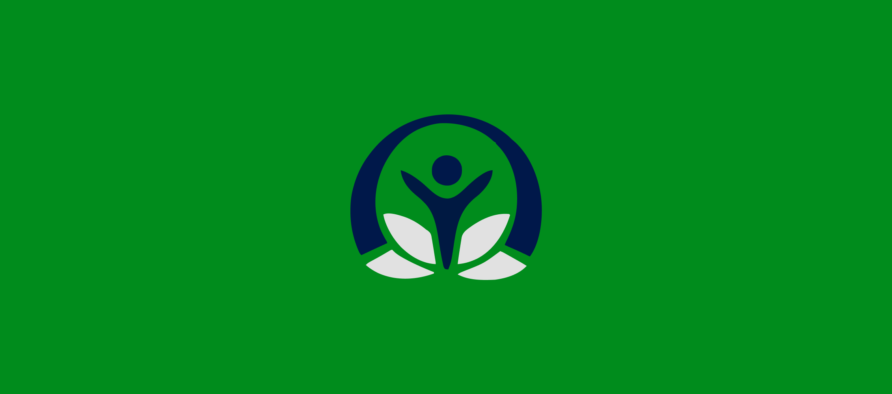
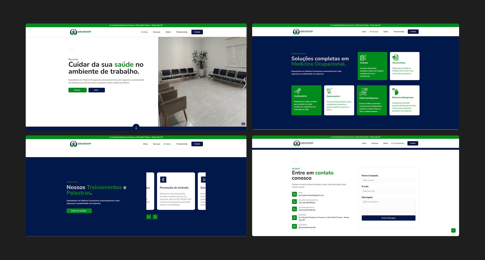

# Clínica Pró-Saúde 🏥💉

&nbsp;

## 📚 Informações sobre o projeto

* O projeto consistiu no desenvolvimento de uma Landing Page institucional para a clínica Pro Saúde, apresentando seus serviços, equipe de profissionais, cursos oferecidos e demais informações relevantes sobre a empresa. Trata-se de um trabalho realizado como freelancer, com foco em comunicação clara, organização do conteúdo e experiência do usuário.
&nbsp;

## 🎨 Telas do projeto

&nbsp;

## 🛠️ Tecnologias/Ferramentas utilizadas

* React 
* Typescript
* Tailwind
* Shadcn/Ui
* Framer Motion
* React Scroll
* Email Js
* Zod

&nbsp;

---

Feito com 💚 por <a href="https://jhonatas-portfolio.vercel.app/">Jhonatas Micael</a>

